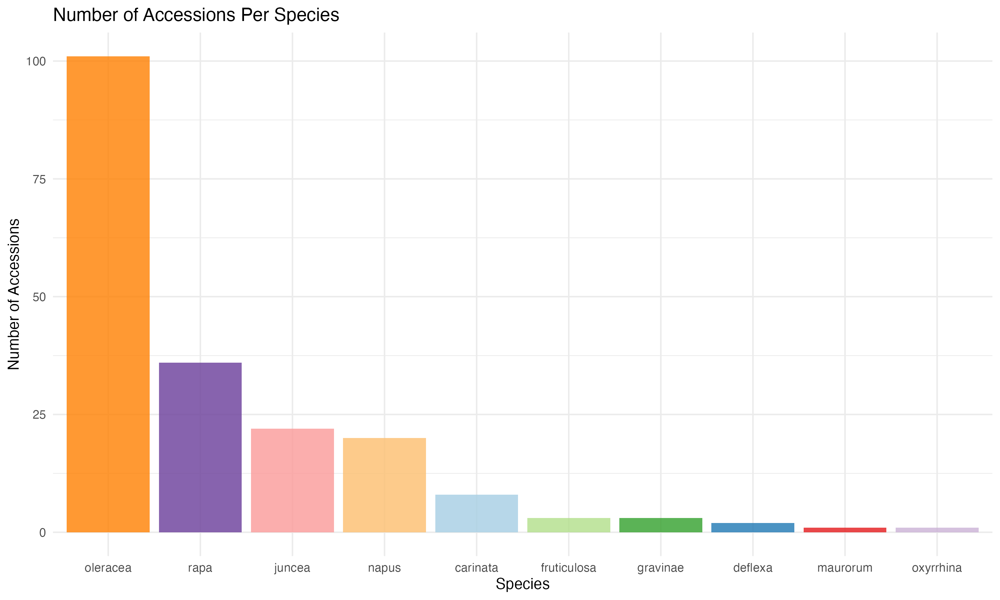
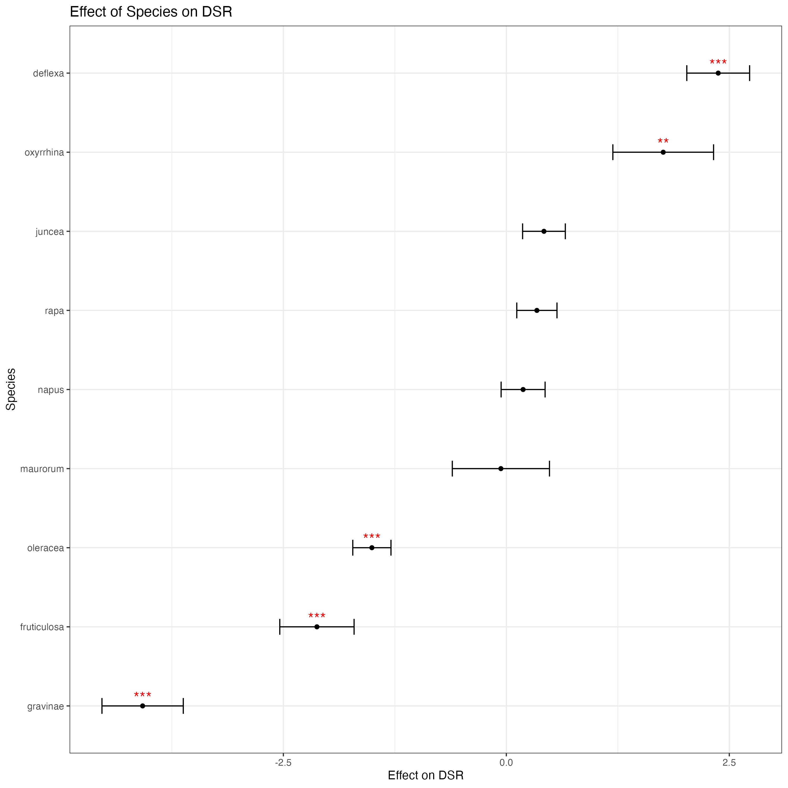

```{r setup, include=FALSE}
knitr::opts_chunk$set(echo = FALSE)
```

## Uncovering Genetic Resistance to DNA Viruses in *Brassica* Species

#### Hales, A. K., Lazarte, L., Laney, A., Liang, Y . Y .


### Introduction

197 Accessions were requested from the USDA germplasm system to be screened for virus disease resistance. The distribution of these species can be seen below.
```{r}

```


The country of origin for these accessions can be seen below. 
```{r}
knitr::include_graphics("Plots/p2_Country.png")
```

### Results
DSR Progression
```{r}
knitr::include_graphics("Plots/p1_anim.gif")
```

DSR Distribution 
```{r}

```

### Discussion
We fitted a lmer model to explain this data given the important variables being tested Origin and Species.


Let's see how origin and species affected the DSR. Note Stars indicate statistical significance

```{r}
knitr::include_graphics("Models/m1_1_origin.png")
```


Now here is Species

```{r}

```


