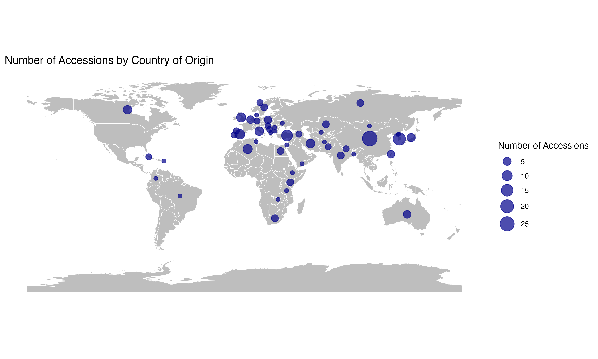
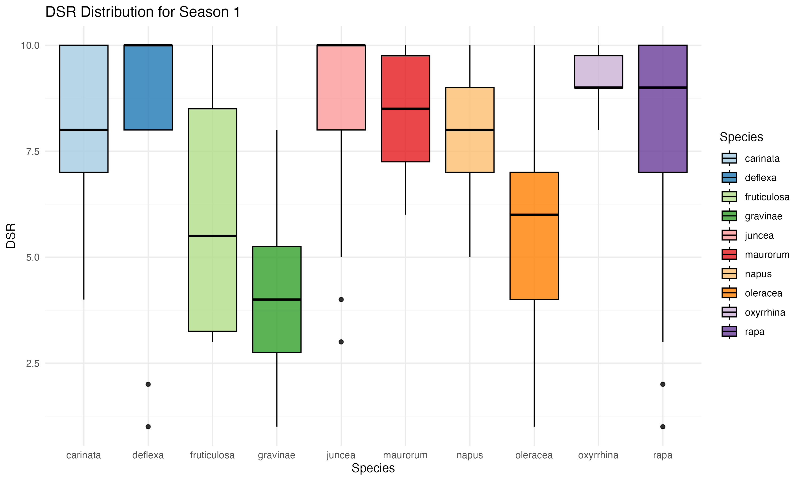

```{r setup, include=FALSE}
knitr::opts_chunk$set(echo = TRUE)
```

## Uncovering Genetic Resistance to DNA Viruses in *Brassica* Species

#### Hales, A. K., Lazarte, L., Laney, A., Liang, Y . Y .


### Introduction
This is where I will put some junk about the project. 

197 Accessions were requested from the USDA germplasm system to be screened for virus disease resistance. The country of origin for these accessions can be seen below. 
```{r, echo=FALSE}

```

### Results

DSR Distribution for Season 1
```{r, echo = FALSE}

```

DSR Distribition for Season 2

