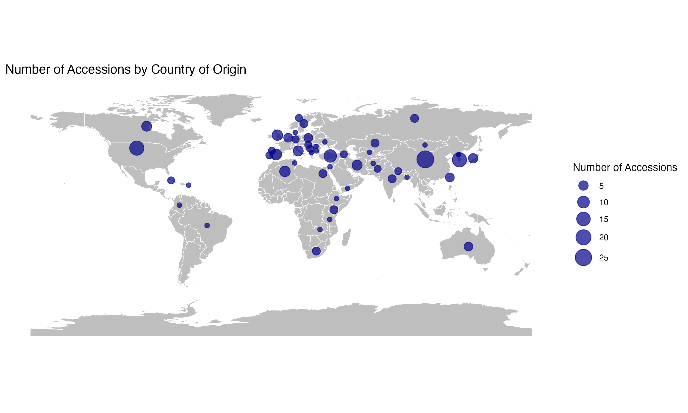
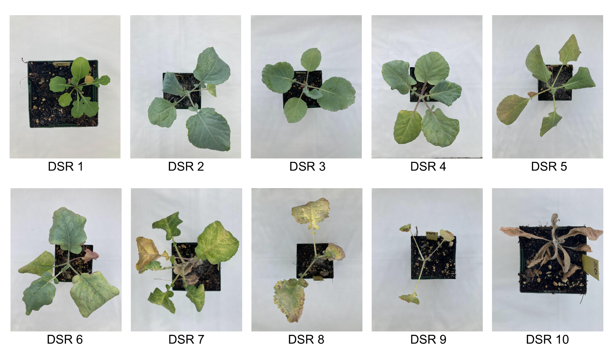
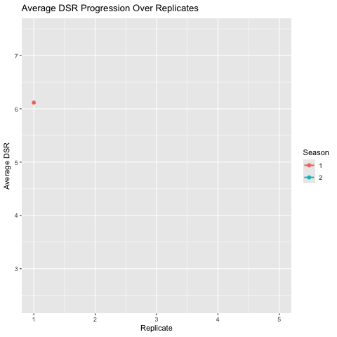
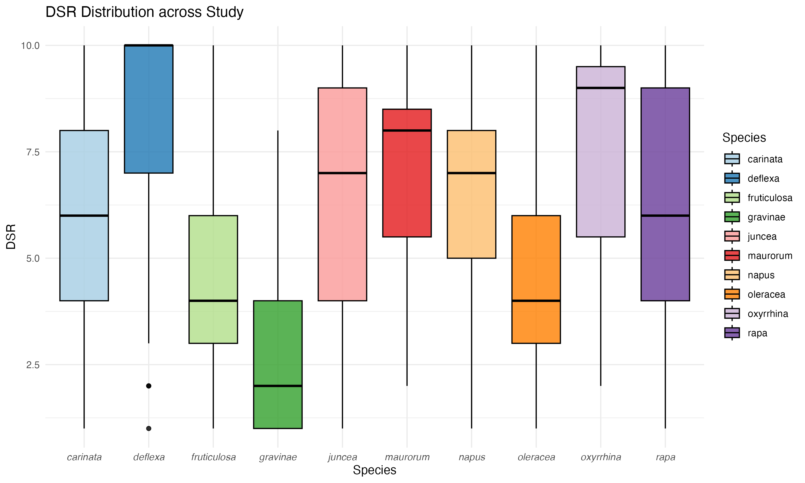
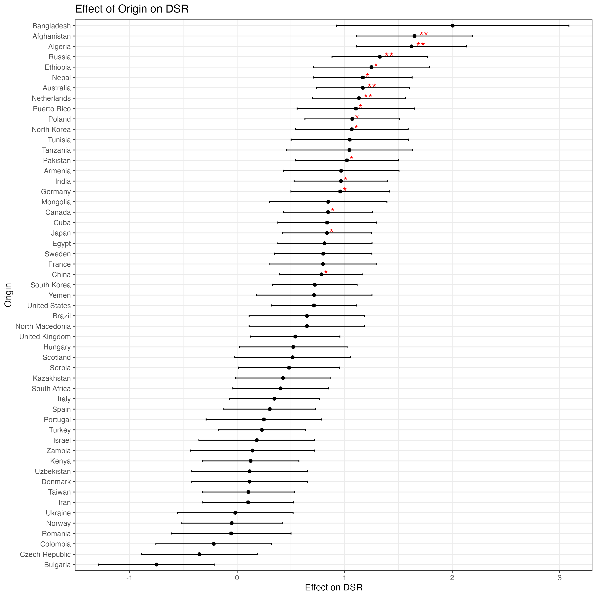

<style>
body {
  background-color: #e0e0e0;
}

.main-container {
  background-color: #e0e0e0;
  color: #1a1a1a;
  padding-top: 20px;
}

section.content {
  background-color: #e0e0e0;
}

div.tocify {
  background-color: #f0f0f0;
  border-radius: 8px;
}
</style>

```{r setup, include=FALSE}
knitr::opts_chunk$set(echo = FALSE)
```

## Uncovering Genetic Resistance to DNA Viruses <br> in *Brassica* Species

##### Adam K Hales, Laureana Lazarte, Alma Laney, Yu-Ya Liang
###### Report prepared by Adam K Hales

----

### Introduction
- A recently discovered putative DNA virus causes significant damage to Brassica species in Utah. 
- This virus is vectored by *Brevicoryne brassicae*, the cabbage aphid, and induces necrotic lesions and
  brittle leaves in infected plants. 
- The objective of this study was to investigate the genetic basis of resistance to this virus.

---

### Methods
#### Plant Material
- 200 Accessions were screened. This included 197 accessions from the USDA Germplasm System and 3 commercially   available varieties.
- Species diversity was of great importance to us in this study. To this extent, accessions from 10 different
  *Brassica* species were screened.
```{r}

```
- Additionally, it was important to us to screen accessions from across the world, as genetic information underlying virus disease resistance could be from the wild-type populations. 
```{r}

```

#### DNA Collection & Extraction
- Leaf tissue was removed once plants had produced sufficient leaf tissue to obtain a sample. 
- After collection, leaf tissue was stored at -80C until DNA extraction was performed. 
- DNA extraction was done using a kit optimized for leaf tissue extraction.
- DNA quality was evaluated using qubit prior to sequencing.
- Sequencing results are currently being processed and will be used in a GWAS.

---

#### Experimental Design
- This study was conducted in a controlled greenhouse environment using single pots to seperate accessions in a Randomized Complete Block Design for two growing seasons. 
- A drip system was designed and utilized to allow for uniform water application and water conservation. 
- Plants were grown for 45 days before inoculation. Plants were inoculated using a symptomatic cabbage aphid colony from the Laney Lab at Utah Valley University. 
- After inoculation, plants underwent an incubation period until plants began to show symptoms of infection which took roughly 14 days following inoculation. 
- To evaluate plants' response to infection, a novel disease severity rating (DSR) was developed, as there were no previously reported evaluation metrics for this virus-host interaction. 
- The DSR used a scale from 1 to 10 to assess the plant’s condition following infection, where a score of '1' indicated complete plant health, and '10' represented complete plant death.
```{r}

```

---

### Results
#### DSR Progression

- For growing season 1, average DSR began and ended higher than season 2. 
- In growing season 1, only two evaluations were conducted.
- Three DSR evaluations were made for growing season 2. 
- Average DSR for all plants increased at an almost linear rate until final evalution.
- Plant health declining with passing evaluations.

```{r}

```

---

#### DSR Distribution Across Species
- The average DSR for all species across the study can be seen below. 
- Note the low average DSR for *gravinae*, *fruiticulosa*, and *oleraceae* species.

```{r}

```

---

#### Accession Performance
- A list of accessions screened can be found below in ascending order of DSR
- Note germplasm accession number, which is the official identification tag of that particular accession

<details>
<summary><strong>Click to expand full list of accessions results</strong></summary>
<br>
```{r, results='asis', echo=FALSE, warning=FALSE, message=FALSE, error=FALSE}
htmltools::includeHTML("./Plots/Accession_Table.html")
```
</details>

---

#### Model and Output
- We fitted a linear mixed-effects rgression model to assess the effects of origin and species on DSR, while accounting for the random effects of block, growing season, and replicate.
- For this model, block is nested within season as block randomization differed between the two growing seasons. 

<details>
<summary><strong>Click to expand full LMER model results</strong></summary>
<br>
```{r, results='asis', echo=FALSE}
htmltools::includeHTML("./Models/Model_Summary.html")
```
</details>
- When accounting for random effects, this model explained about 74 percent of the dataset.

Below is a table of the significant predictors of DSR.
```{r echo=FALSE, error=FALSE, message=FALSE, warning=FALSE, results='asis'}
htmltools::includeHTML("./Models/Sig_Fixed_Effects_1.html")
```

---

The effect of origin on DSR is shown below. Note that the asteriks indicate the level of significance. 

- __*** indicates a p-value of <0.001__
- __** indicates a p-value of ≤ 0.01.__
- __* indicates a p-value of ≤ 0.05.__
- No asteriks indicate no statistical significance.
```{r}

```

---

The effect of species on DSR is shown below. Note that the asteriks indicate the level of significance. 

- __*** indicates a p-value of <0.001__
- __** indicates a p-value of ≤ 0.01.__
- __* indicates a p-value of ≤ 0.05.__
- No asteriks indicate no statistical significance.
```{r}

```

---

### Discussion

#### Effect of Origin on DSR

- Accessions with origins of Afghanistan, Algeria, and Russia seem to be more susceptible to this given virus. 
- For all other origins, data is not statistically significant. 


#### Effect of Species on DSR

- Species that are negatively correlated with DSR could exhibit resistance against the virus, and could posess disease resistant alleles that would be valuable in breeding practices.
  - These species include *gravinae*, *fruiticulosa*, and *oleraceae*. Each of which were roughly 1-3 DSR points lower than the other species. 
- Species that are positively correlated with DSR could be exhibit susceptibility to this putative DNA virus. 
  - These species include *deflexa* and *oxyrrhia*. 

---

### Acknowledgements

<div>

- UVU Scholarly Activities Committee  
- UVU Undergraduate Research Scholarly and Creative Activities Program  
- UVU Plant Breeding and Genetics Lab – Dr. Yu-Ya Liang  
- Dr. Alma Laney and Lab  

</div>

<br>

<div style="text-align: center;">
  
  
</div>