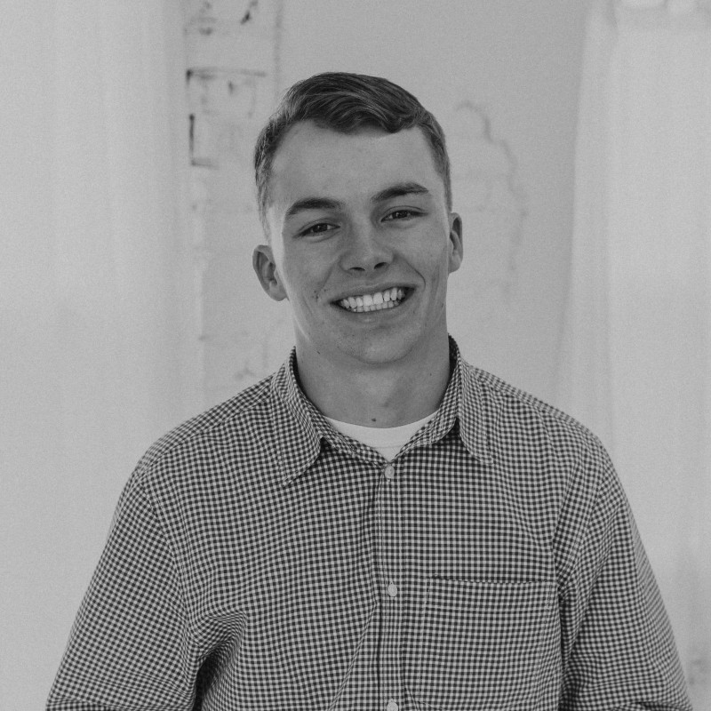

<!-- Embedded custom CSS for styling -->
<style>
body {
  background-color: #808080; 
  font-family: 'Source Sans Pro', Arial, sans-serif;
  color: #1a1a1a; /* Strong dark text */
  padding: 50px;
  margin: 0;
}

h1, h2, h3 {
  font-weight: 600;
}

.container {
  max-width: 900px;
  margin: auto;
  background: #F5F5F5;
  padding: 40px;
  border-radius: 8px;
  box-shadow: 0 4px 12px rgba(0,0,0,0.1); /* Subtle shadow */
}

img {
  float: right;
  width: 180px;
  height: auto;
  margin-left: 30px;
  margin-bottom: 20px;
  border-radius: 8px;
  box-shadow: 0 4px 8px rgba(0,0,0,0.1); /* Photo shadow */
}
</style>

<!-- Start of page content -->

<div class="container">

```{r setup, include=FALSE}
knitr::opts_chunk$set(echo = TRUE)
```



### Hi, I'm Adam! <br> 
This is my personal website landing page which also includes information about me, my research interests, and current/past projects.

---

I have just started a new position of PhD candidate at the University of Georgia in Plant Breeding, Genetics, and Genomics. 

---

#### Featured Project
[Brassica](http://halesadam.github.io/Final_Project/): Discover my work on virus disease resistance in *Brassica* species. 

#### About Me
I grew up farming and ranching in northern Utah where I first developed a love for plants and producing food to feed the world. <br> I chose to take that passion and to make it the discipline of my academic career. <br> Outside of farming and research, I enjoy playing guitar, reading, cooking/baking, and playing golf.

#### Contact 

📧 Email: halesadam02@gmail.com

💻 [My GitHub](http://www.github.com/halesadam)

🌐 [My LinkedIn](http://www.linkedin.com/in/adam-hales-546900226)
